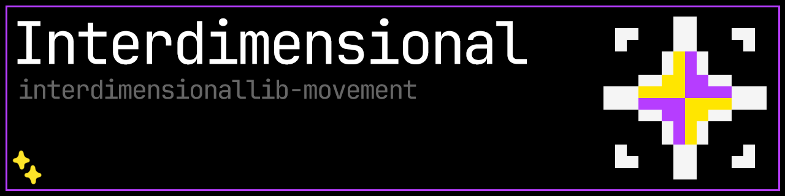

# InterdimensionalLib
Library for all my mods :P
## About
Provides most overused functions that I need for the **_mods_**.
## Included
- **Grindstone Polish Recipe**  
    Custom recipes for right-clicking grindstone.
- **Custom block set type registration**  
    Add your own BlockSetType. Also buttons and pressure plates now support `canOpenByWindCharge` and `canOpenByHand`.
- **Registration for custom note block instruments**  
    Add your own NoteBlock instruments.
- **Utils for datapacks**  
    Camera screenshake, screen closing, gui hiding, sky and fog modification.
- **Custom biome registry**  
    Registry and a mixin to register your own biomes.
- **Scaffoldings as a tag**  
    Now all scaffoldings are handled through mixin and a tag.
- **Various utils**  
    Like AdvancementHandler, MathUtils, ItemUtils, OptionLocker